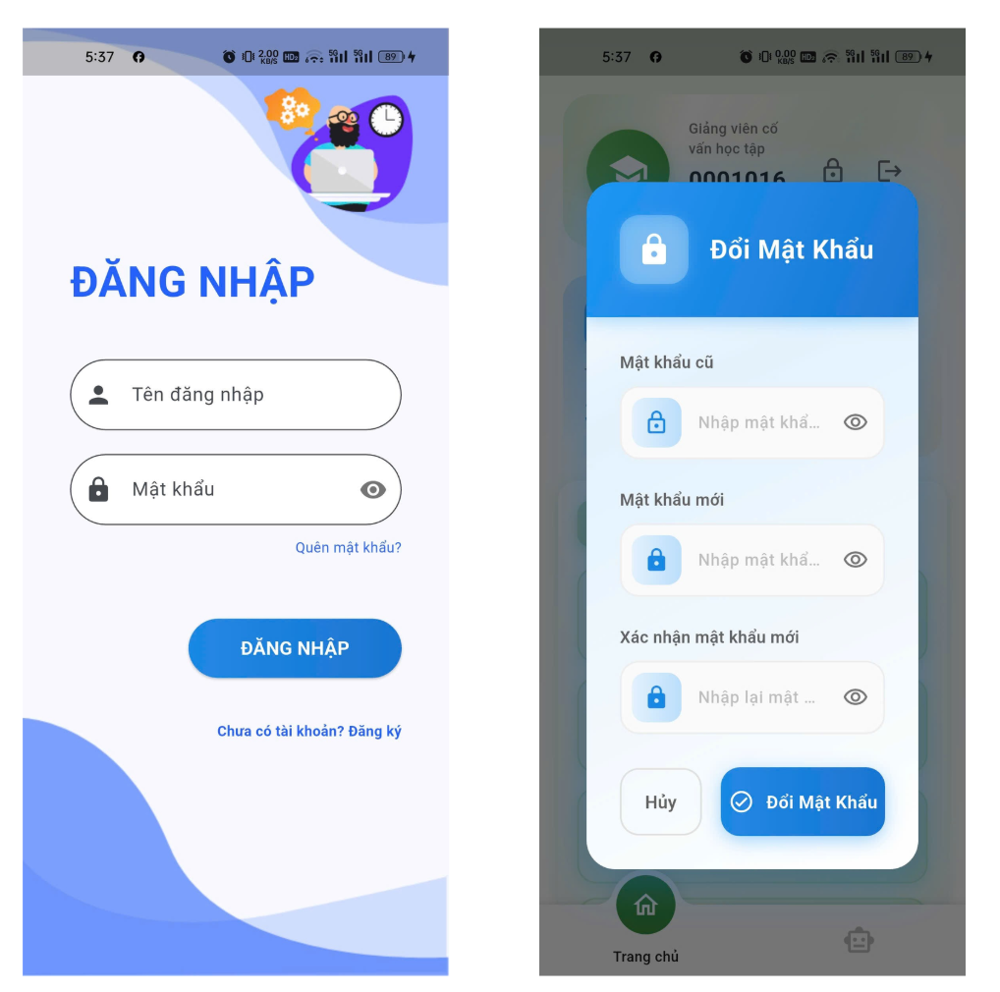
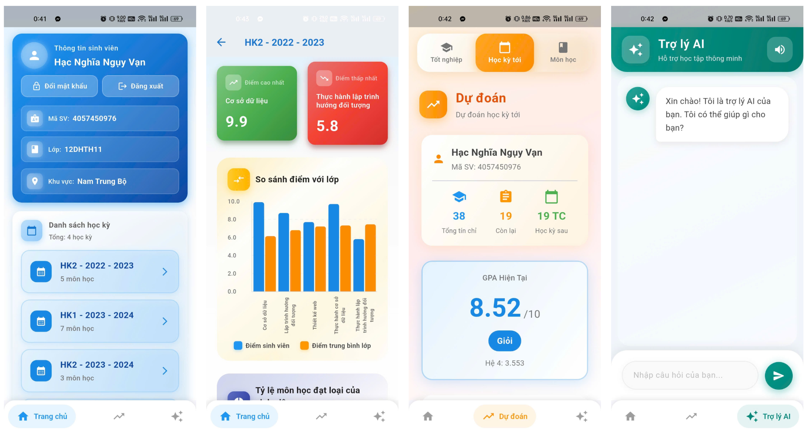
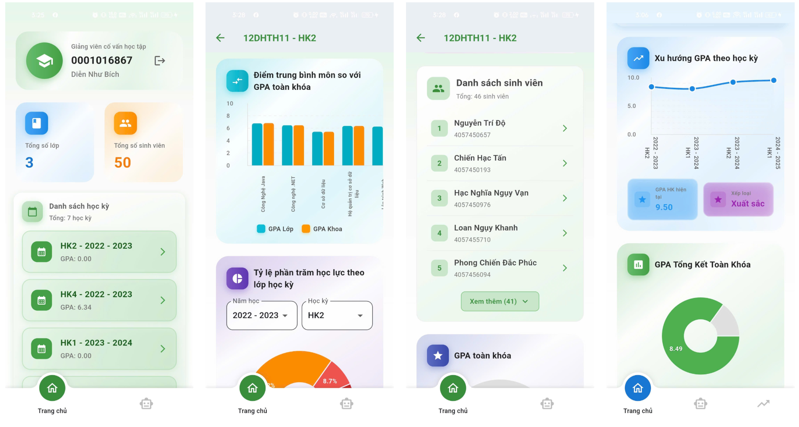

# 📊 IT Academic Analytics - Mobile Application
**Phần mềm phân tích và dự báo kết quả học tập thuộc dự án Kho dữ liệu (Data Warehouse)**

## 📖 Giới thiệu
Đây là ứng dụng di động được phát triển nhằm trực quan hóa dữ liệu từ kho dữ liệu (Data Warehouse) của khoa Công nghệ Thông tin. Ứng dụng cung cấp các báo cáo phân tích đa chiều cho cả Sinh viên và Giảng viên, hỗ trợ theo dõi tiến độ học tập và đưa ra các dự báo dựa trên trí tuệ nhân tạo.

---

## 🛠 Công nghệ sử dụng
* **Frontend:** Flutter (Mobile đa nền tảng - Android & iOS).
* **Data Visualization:** Syncfusion Charts / Fl Chart (Biểu đồ trực quan).
* **Backend Integration:** Kết nối API từ hệ thống Data Warehouse.
* **AI & Logic:** Python (Mô hình dự báo kết quả học tập & Trợ lý ảo AI).

---

## 🚀 Tính năng chính

### 1. Dành cho Sinh viên
* **Thống kê chi tiết:** Theo dõi GPA, điểm số và phân loại môn học qua từng học kỳ.
* **So sánh & Phân tích:** Biểu đồ so sánh điểm số và phân tích thế mạnh học tập.
* **Dự đoán kết quả:** Sử dụng mô hình AI để dự đoán xu hướng học lực trong tương lai.
* **Trợ lý ảo AI:** Hỗ trợ tra cứu thông tin học tập và giải đáp thắc mắc qua hội thoại.

### 2. Dành cho Giảng viên & Quản lý
* **Dashboard tổng quát:** Theo dõi tỷ lệ đậu/rớt và GPA trung bình của các lớp theo kỳ.
* **Phân tích chi tiết lớp:** Thống kê tỷ lệ học lực, xếp loại theo môn học của từng lớp cụ thể.
* **Hỗ trợ giảng dạy:** Trợ lý AI phân tích các chỉ số học tập để giảng viên kịp thời hỗ trợ sinh viên có nguy cơ rớt môn.

---

## 📱 Demo Giao diện ứng dụng

### 1. Giao diện đăng nhập và đổi mật khẩu, quên mật khẩu 

  

---

### 2. Hệ thống dành cho Sinh viên

  

---

### 3. Hệ thống dành cho Giảng viên

  

---

## 💡 Kết quả đạt được
* **Trực quan hóa hiệu quả:** Chuyển đổi các khối dữ liệu OLAP phức tạp thành các biểu đồ dễ hiểu trên thiết bị di động.
* **Tính chủ động:** Giúp sinh viên tự theo dõi lộ trình học tập và giảng viên quản lý lớp học hiệu quả hơn nhờ các chỉ số cảnh báo sớm.
* **Tích hợp công nghệ mới:** Ứng dụng thành công AI vào việc hỗ trợ phân tích giáo dục
